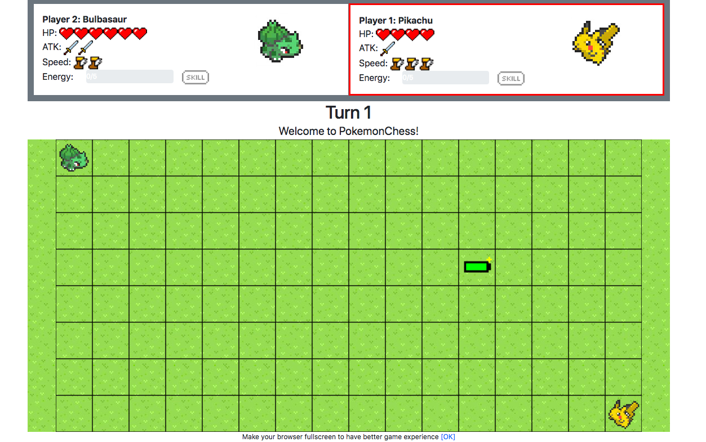

# PokemonChess

# Please check the "screenshots" folder before/during reading this documentation

# Disclaimer:
This game is created by a Pokemon enthusiast, and it is for educational purpose only.
Any of the trademarks, service marks, collective marks, design rights, personality rights, or similar rights that are mentioned, used, or cited in this game are the property of their respective owners.

***Recommended Specifications***
- Highly recommend to download this repl and play it locally (repl.it makes the animations terribly displayed)
- Any OS with at least 1366x768 screen resolution
- Play it on Google Chrome browser with fullscreen mode
- Is a Pokemon fan

***Introduction:***

This game is similar to a chess game but with Pokemon characters and items. I also take games "Super Robot War" and "Summon Board" as gameplay references. 

There are 4 available characters: Pikachu, Bulbasaur, Squirtle, and Charmander. Different characters have different skill moves. The player have to pick a character and defeat another player (or the AI) on a 8*16 battlefield.

***Gameplay:***

Support single player/2 players mode.

Player 1 (you) pick a character (a Pokemon) first, then Player 2 (or click single player mode, then the AI will pick a character randomly).
After entered the battlefield, there will be a scoreboard for each player, displaying the stats (hp, attack, speed, energy) of their characters.

***Move:***

Players take turns to move. In each turn, a character can only either move or cast a skill. Whenever a character casts a spell or move, its turn ends. The game continues until one of the characters' hp is <= 0.

***Attack:***

Characters can attack only by using skills. Skills can only be casted when the energy is full (100%). The range of different skills are demonstrated under the "screenshots" folder (the skill range can't be seen in the game until it is casted).
The damage of the skill depends on the character's attack (can be cumulated with attack+ item).

***Skills:***

Check "screenshots" folder for the skill images demo
Pikachu: selects 8 random columns and hits them with thunders;
Bulbasaur: hits horizontal, vertical, diagonal lines within 4 grids with leaves
Charmander: burns 3 horizontal lines (i-1, i, i+1)
Squirtle: takes self as the center, hits a 5x5 square with bubbles

***Speed:***

Speed indicates at most how many grids you can move from your current location.

***Energy:***

Energy will be charged every time when a character moves, or consume an energy+ item. The charging speed depends on the character (Pikachu: 50%/turn, Bulbasaur: 25%/turn, Squirtle: 25%/turn, and Charmander: 20%/turn). Energy will be fully consumed (0%) after a skill is casted.

***Movement:***

When it is a player's turn, click your character, then several red layers will be displayed, indicating your movement range (check the "screenshots" folder to explore range of different pokemon). Click on any red layer to move to that location. Can't move to a grid that already has a character there.

***Item:***

A random item will be spawned on the battlefield every 5 turns. Move to that grid will consume the item and apply the effect immediately. Heart: +1 HP, sword: +1 attack, boots: +1 speed, battery: +{character's energyCharge}% energy.

***AI:***

If player 1 chooses single player mode, then player 2 will be controlled by an "AI" (not that intelligent though).

The AI follows the flow below:

if have enough energy 
  ->if enemy is in attack range 
    -> attack
  ->if not in attack range, but AI have enough hp
    -> attack mode: move toward enemy
  ->else
    -> defense mode: look for items
else
  -> defense mode: look for items

Stops when the game is over.

***Game key logics/flow explain (brief):***

key variables: 
monster1: an object, stores information of player 1's Pokemon, e.g. name, atk, hp, i, j etc.
monster2: another object that stores information of player 2's Pokemon
currMonster: stores the pointer of the current turn's Pokemon, to determine who's turn is it

a special function:
pseudoStyle(): a custom helper function created for DOM element. It will add new styles in <style> tag in the head during runtime. Used for displaying movement range red layers and Pokemons' skill animation. When the argument is "", which means pseudoStyle("") is called, the function clears all styles in <style> tag, to achieve the effect of cleaning the layers

When index.html loaded, the "chooseArea" div displays 4 different Pokemons for the player to choose. After two Pokemons are chosen, initializes the (i,j) of monster1 (7,15) and monster2 (0,0). The "chooseArea" div will then disappear, and the "grid" div shows up, initializes the battlefield by calling setup() function. Then call initMonsterStats() to initilize the scoreboard of the Pokemons.

Then Player 1 starts his/her action -> Player 2 -> ...

Whenever a grid is clicked, the buttonClicked(i, j) will be called. If that grid is the current turn's Pokemon (currMonster), display its movement range(several red layers). After the range is shown, if one of the range grid is clicked, move the Pokemon to that location (except there is another Pokemon there) by calling swapButton(i1, j1, i2, j2) to swap the images and attributes etc. If that location contains an item, consume it and apply its effect. After moving, charge the energy of that monster (only if energy < 100), and set currMonster to another Pokemon (call the nextTurn() function).

When a skillButton (on the scoreboard) is clicked, skillButtonClicked() will be called to check the monster's energy first, then check which Pokemon is it, and display that Pokemon's skill animation (used setInterval), and calculates the damage afterwards.

More helper functions are explained in the code file

***Future Plan:***

-Multiplayer mode

-Story mode (challenge different Pokemons and bosses)

-Cleverer AI

-Make the characters more balance

-BGM/sound effects
